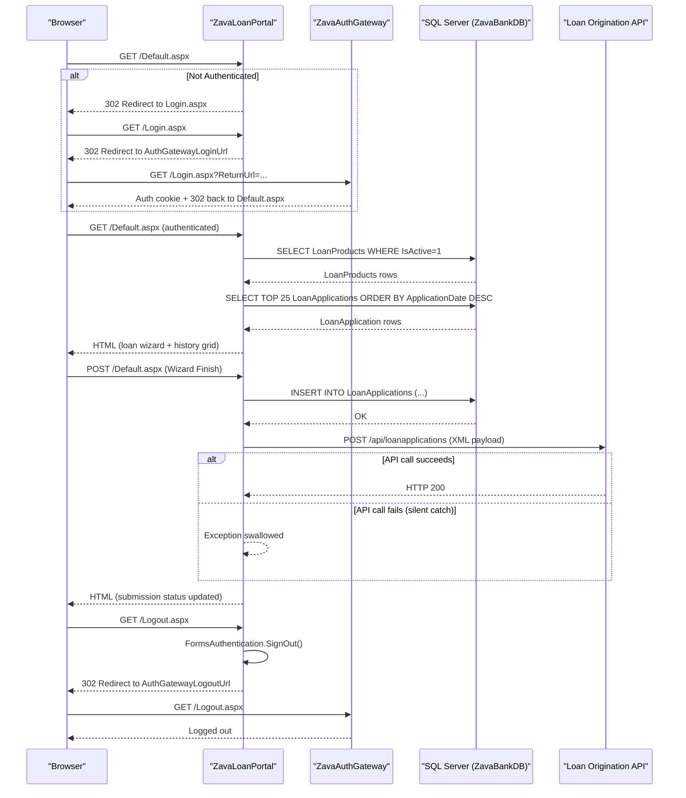

# API & Service Communication Contracts

ZavaLoanPortal exposes no REST API endpoints of its own; it is a server-rendered ASP.NET Web Forms application that communicates outbound with two external HTTP services (ZavaAuthGateway and Loan Origination API).

## Service Catalog

| Service | Port | Category | Purpose |
|---|---|---|---|
| ZavaLoanPortal | 80 (IIS/HTTP) | Business | Server-rendered loan application portal for customers |
| ZavaAuthGateway | configurable (AuthGatewayLoginUrl) | Infrastructure | External identity and authentication service |
| Loan Origination API | 8080 (LoanOriginationApiUrl) | Business | Downstream service that processes submitted loan applications |
| SQL Server (ZavaBankDB) | 1433 | Infrastructure | Relational database storing loan products and applications |

## API Endpoints Inventory

ZavaLoanPortal does not expose HTTP API endpoints. All interactions are server-side Web Forms page lifecycle events. The table below documents the effective request surface from the browser's perspective:

| Service | Method | Path | Request Type | Response Type |
|---|---|---|---|---|
| ZavaLoanPortal | GET/POST | /Default.aspx | Browser form postback | HTML page (loan wizard, history grid) |
| ZavaLoanPortal | GET/POST | /Login.aspx | Query string (ReturnUrl) | HTML redirect to ZavaAuthGateway |
| ZavaLoanPortal | GET/POST | /Logout.aspx | None | Redirect to AuthGatewayLogoutUrl |
| Loan Origination API | POST | /api/loanapplications | XML body (loan application fields) | HTTP response (ignored by portal) |

> Note: ZavaLoanPortal does not define REST controllers or API routes. All inbound paths are Web Forms .aspx pages handled by ASP.NET's HTTP runtime.

## Management & Observability Endpoints

| Service | Endpoint | Custom Metrics |
|---|---|---|
| ZavaLoanPortal | None | None |

No health check endpoints, Swagger UI, or metrics endpoints are configured. The application does not expose `/health`, `/swagger`, or any actuator-equivalent endpoints.

## DTOs & Contracts

ZavaLoanPortal does not define formal DTO or contract classes. Loan application data is collected directly from Web Forms controls (`TextBox`, `DropDownList`, `Wizard`) and serialized inline as a hand-built XML string before being sent to the Loan Origination API:

```
<loanApplication>
  <customerId>{int}</customerId>
  <loanProductId>{int}</loanProductId>
  <requestedAmount>{decimal}</requestedAmount>
  <termMonths>{int}</termMonths>
</loanApplication>
```

There are no OpenAPI/Swagger specifications, protobuf schemas, or GraphQL schemas. No serialization framework (System.Text.Json, Newtonsoft.Json) is used — XML is constructed via string concatenation. Full field-level details of database entities are documented in `data-architecture.md`.

## Communication Patterns

**Synchronous — outbound HTTP POST (fire-and-forget):**
The `Default.aspx` code-behind calls `SubmitApi()` which uses `System.Net.HttpWebRequest` to POST an XML payload to the Loan Origination API URL configured in `web.config` (`LoanOriginationApiUrl`). The response body is read and discarded. All exceptions are silently caught with an empty `catch {}` block, making this effectively a best-effort, fire-and-forget call with no retry or circuit-breaker logic.

**Synchronous — redirect-based authentication:**
Login and logout flows redirect the browser to external URLs configured in `web.config` (`AuthGatewayLoginUrl`, `AuthGatewayLogoutUrl`). There is no token exchange or back-channel call; authentication state is managed entirely through Forms Authentication cookies (`.ZAVAAUTH`).

**Synchronous — SQL Server queries:**
All database access uses synchronous ADO.NET `SqlConnection`/`SqlCommand` calls. There is no connection pooling configuration, retry policy, or timeout override beyond the ADO.NET defaults.

**Resilience:** No retry policies, circuit breakers, timeouts, or bulkhead patterns are implemented. The Loan Origination API call silently fails on any exception.

**Service discovery:** Services are discovered via hardcoded URLs in `web.config` (`AuthGatewayLoginUrl`, `AuthGatewayLogoutUrl`, `LoanOriginationApiUrl`, `ZavaBankDb` connection string). There is no service registry, Kubernetes DNS resolution, or dynamic discovery mechanism.

**Security posture:** The application uses Forms Authentication with a static `machineKey` hardcoded in `web.config`. All pages except `Login.aspx` and `Logout.aspx` require authentication via `<deny users="?" />`. There is no TLS enforced at the application level (relies on IIS/infrastructure), no CSRF protection, and no authorization beyond the authentication check. The outbound call to the Loan Origination API uses plain HTTP with no authentication headers.

## Service Technology Matrix

| Service | Web | Data Access | Discovery | Gateway | Health Checks | Cache | Metrics |
|---|---|---|---|---|---|---|---|
| ZavaLoanPortal | ASP.NET Web Forms 4.8 | ADO.NET SqlClient | None (hardcoded URLs) | None | None | None | None |
| ZavaAuthGateway | Unknown (external) | Unknown | N/A | N/A | N/A | N/A | N/A |
| Loan Origination API | Unknown (external) | Unknown | N/A | N/A | N/A | N/A | N/A |

## Service Communication Sequence


