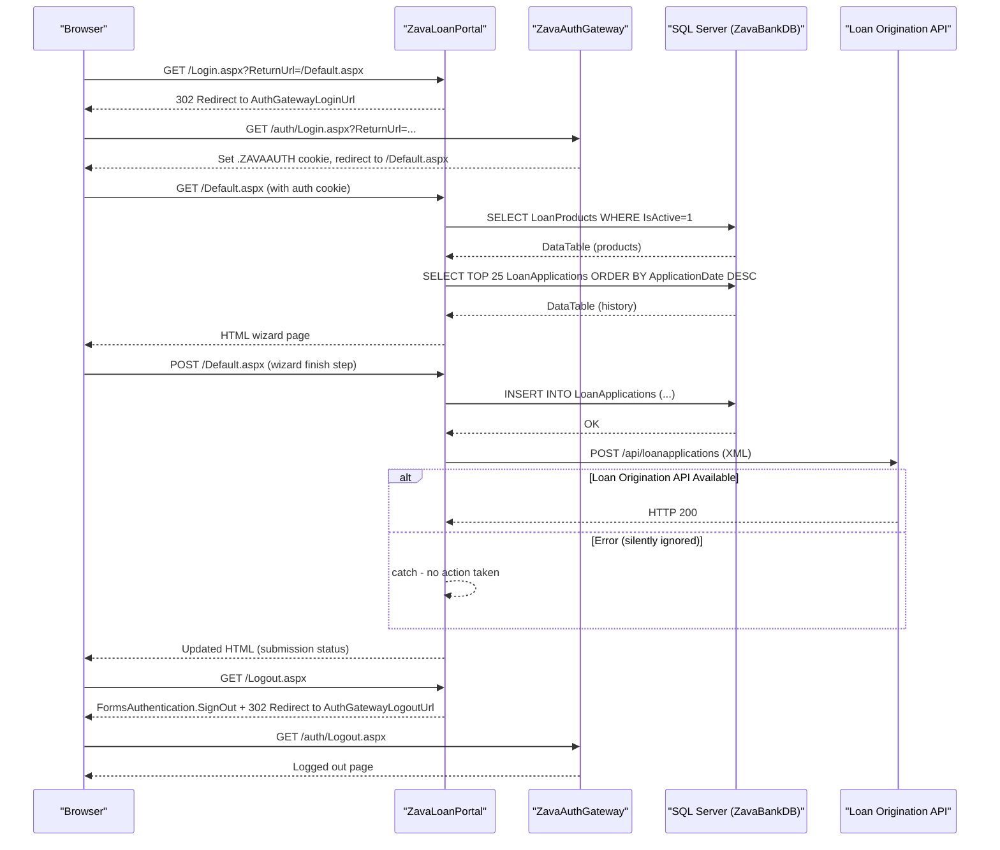

# API & Service Communication Contracts

ZavaLoanPortal is a single-tier ASP.NET WebForms application that exposes no REST or RPC API surface of its own; all user interaction is via server-rendered HTML pages, and outbound communication is limited to two external HTTP services (ZavaAuthGateway and Loan Origination API).

## Service Catalog

| Service | Port | Category | Purpose |
|---------|------|----------|---------|
| ZavaLoanPortal | 80 (HTTP) | Business | ASP.NET WebForms portal for loan application submission and history |
| ZavaAuthGateway | 80 (configured via `AuthGatewayLoginUrl` / `AuthGatewayLogoutUrl`) | Infrastructure | External authentication gateway handling login and logout redirects |
| Loan Origination API | 8080 (configured via `LoanOriginationApiUrl`) | Business | Downstream REST/XML API that processes submitted loan applications |
| SQL Server (ZavaBankDB) | 1433 | Infrastructure | Relational database storing loan products and loan applications |

## API Endpoints Inventory

ZavaLoanPortal itself exposes no REST or web-API endpoints. User access is via ASP.NET WebForms page URLs:

| Service | Method | Path | Request Type | Response Type |
|---------|--------|------|-------------|--------------|
| ZavaLoanPortal | GET/POST | `/Default.aspx` | WebForms postback (form fields) | HTML page (loan wizard, history grid) |
| ZavaLoanPortal | GET | `/Login.aspx` | Query string `ReturnUrl` | HTML page (redirect to AuthGateway) |
| ZavaLoanPortal | GET | `/Logout.aspx` | None | Redirect to AuthGateway logout URL |
| Loan Origination API (outbound) | POST | `/api/loanapplications` | XML body (`<loanApplication>`) | HTTP 200 (response body ignored) |

> Note: The Loan Origination API endpoint path is inferred from the `LoanOriginationApiUrl` app setting value (`http://zava-loan-origination-api:8080/api/loanapplications`). No response contract is processed by the portal.

## Management & Observability Endpoints

| Service | Endpoint | Custom Metrics |
|---------|----------|----------------|
| ZavaLoanPortal | None | None |

No health check endpoints, Swagger UI, or observability instrumentation (Application Insights, OpenTelemetry, etc.) are configured in the application.

## DTOs & Contracts

ZavaLoanPortal defines no DTO or model classes. Loan application data is constructed inline within `Default.aspx.cs` as a raw XML string and posted to the Loan Origination API:

```xml
<loanApplication>
  <customerId>{int}</customerId>
  <loanProductId>{int}</loanProductId>
  <requestedAmount>{decimal}</requestedAmount>
  <termMonths>{int}</termMonths>
</loanApplication>
```

No OpenAPI/Swagger specification, protobuf schema, or GraphQL schema exists. Serialization is manual string concatenation — there is no JSON or XML serializer library in use. Database result sets are materialized into untyped `System.Data.DataTable` objects and bound directly to WebForms controls.

## Communication Patterns

**Synchronous (outbound only):**
- **AuthGateway redirect** — `Login.aspx` and `Logout.aspx` redirect the browser to the configured `AuthGatewayLoginUrl` / `AuthGatewayLogoutUrl` over HTTP. This is a browser-level redirect, not a server-to-server call.
- **Loan Origination API (HTTP POST)** — `Default.aspx.cs` uses `System.Net.HttpWebRequest` to synchronously POST an XML payload. The response body is read but discarded; errors are silently swallowed in a bare `catch {}` block with no retry, timeout, circuit breaker, or fallback logic.
- **SQL Server (ADO.NET)** — All database calls are synchronous, inline `SqlConnection`/`SqlCommand` operations. No connection pool configuration, command timeout, or retry policy is in place.

**Resilience policies:** None. There is no retry, timeout, circuit breaker, or bulkhead pattern implemented for either the Loan Origination API or the database.

**Service discovery:** Services are located via hardcoded URLs in `web.config` (`appSettings`). No DNS-based discovery, Consul, Kubernetes service resolution, or client-side load balancing is in use.

**Security posture:** The application enforces Forms Authentication for all pages except `Login.aspx` and `Logout.aspx` (configured via `<authorization><deny users="?" /></authorization>` in `web.config`). Transport security (HTTPS/TLS) is not configured in `web.config` or the Dockerfile; all communication — including outbound calls to the Loan Origination API and AuthGateway — uses plain HTTP. No per-endpoint authorization (e.g., role checks) is implemented beyond the blanket authentication gate.

## Service Technology Matrix

| Service | Web Framework | Data Access | Discovery | Gateway | Health Checks | Cache | Metrics |
|---------|--------------|-------------|-----------|---------|--------------|-------|---------|
| ZavaLoanPortal | ASP.NET WebForms 4.8 | ADO.NET (raw SQL) | None (hardcoded URLs) | None | None | None | None |
| Loan Origination API | Unknown (external) | Unknown | — | — | — | — | — |
| ZavaAuthGateway | Unknown (external) | Unknown | — | — | — | — | — |

## Service Communication Sequence


