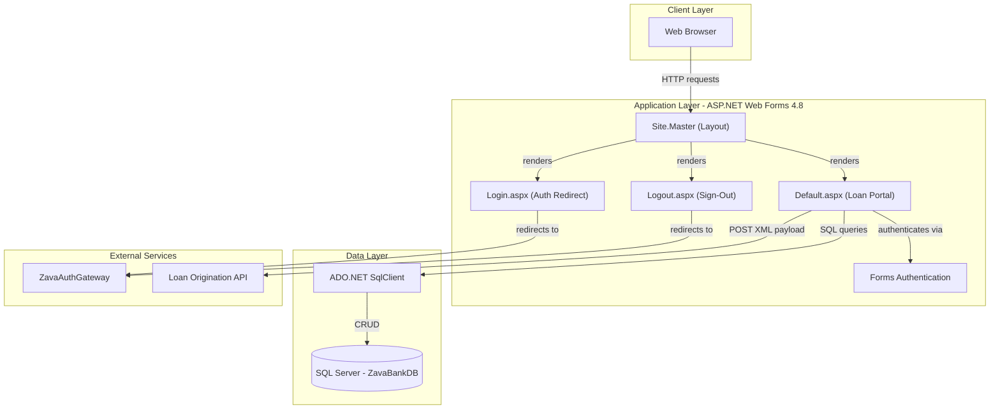
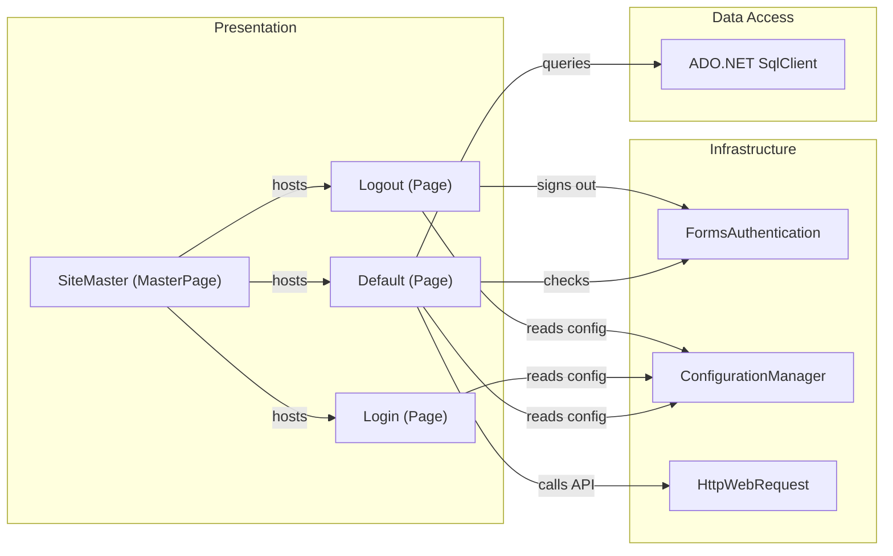

# Architecture Diagram

ZavaLoanPortal is a .NET Framework 4.8 ASP.NET Web Forms application that provides a loan application portal, delegating authentication to an external auth gateway and persisting data in a SQL Server database.

## Application Architecture

### Technology Stack Summary

| Layer | Technology | Version | Purpose |
|---|---|---|---|
| Presentation | ASP.NET Web Forms | 4.8 | Server-side page rendering |
| Presentation | Site.Master | — | Shared layout and navigation |
| Authentication | Forms Authentication | .NET 4.8 | Cookie-based auth with external gateway delegation |
| Data Access | ADO.NET SqlClient | .NET 4.8 | Direct SQL access to SQL Server |
| Data Storage | SQL Server | — | Persists loan applications and products |
| External | ZavaAuthGateway | — | External identity/authentication service |
| External | Loan Origination API | — | Downstream loan processing service (XML/HTTP) |

### Data Storage & External Services

The application uses a single SQL Server database named `ZavaBankDB` accessed via `System.Data.SqlClient` with direct parameterized queries (no ORM). Two external HTTP services are integrated: `ZavaAuthGateway` handles user authentication and sign-out through redirects, and `Loan Origination API` receives new loan application payloads as XML via HTTP POST.

### Key Architectural Decisions

- **Web Forms page lifecycle**: Each `.aspx` page inherits from `System.Web.UI.Page`, handling requests through server-side event handlers (Page_Load, button clicks, wizard events).
- **Inline SQL data access**: All database interactions use raw ADO.NET `SqlConnection`/`SqlCommand` calls directly in code-behind, with no repository or ORM abstraction layer.
- **External authentication delegation**: Login and logout flows redirect users to a separately deployed `ZavaAuthGateway`, with Forms Authentication cookies managing session state within the portal.

## Component Relationships

### Component Inventory

| Component | Layer | Type | Responsibility |
|---|---|---|---|
| SiteMaster | Presentation | MasterPage | Shared layout, navigation bar, user status display |
| Login | Presentation | Web Forms Page | Redirects unauthenticated users to ZavaAuthGateway |
| Default | Presentation | Web Forms Page | Loan product listing, application wizard, history grid |
| Logout | Presentation | Web Forms Page | Signs out the user and redirects to auth gateway logout |
| FormsAuthentication | Infrastructure | .NET Framework class | Issues and validates Forms Auth cookies |
| ConfigurationManager | Infrastructure | .NET Framework class | Reads connection strings and app settings from web.config |
| ADO.NET SqlClient | Data Access | Database driver | Executes parameterized SQL queries against ZavaBankDB |
| HttpWebRequest | Infrastructure | .NET Framework class | POSTs XML loan application payloads to Loan Origination API |
