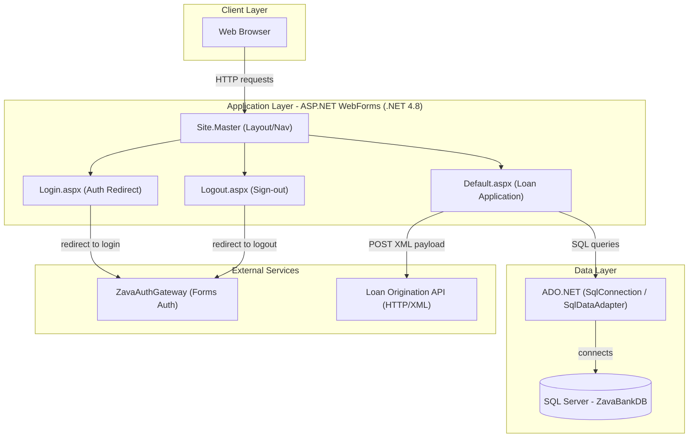
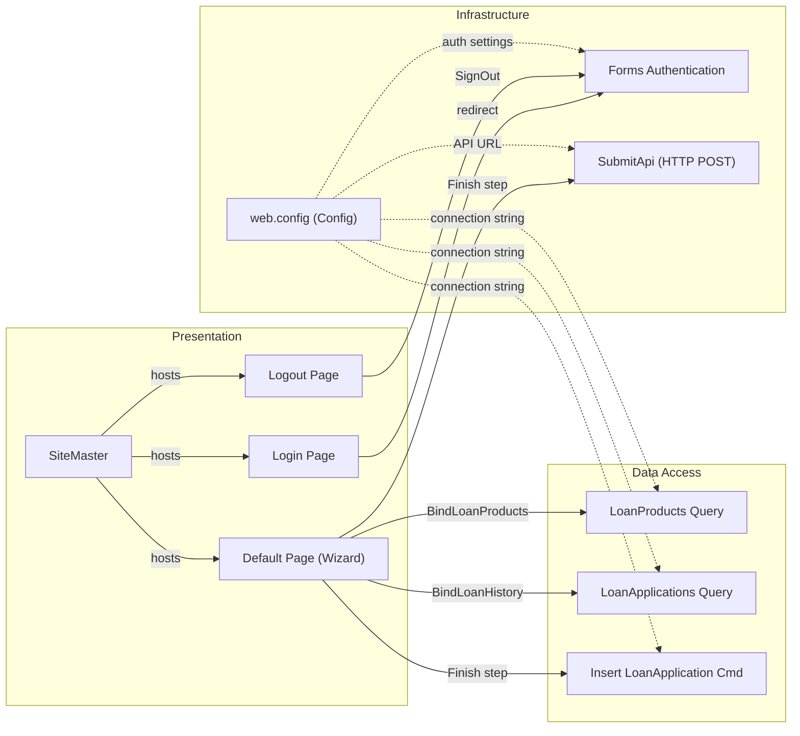

# Architecture Diagram

ZavaLoanPortal is an ASP.NET WebForms application (.NET Framework 4.8) that provides a loan application portal, delegating authentication to an external gateway and persisting loan data to a SQL Server database.

## Application Architecture

### Technology Stack Summary

| Layer | Technology | Version | Purpose |
|-------|-----------|---------|---------|
| Presentation | ASP.NET WebForms | .NET 4.8 | Server-side page rendering with code-behind |
| Presentation | Master Page | .NET 4.8 | Shared layout, navigation, user status display |
| Data Access | ADO.NET (SqlConnection) | .NET 4.8 | Direct SQL queries to SQL Server |
| Data Storage | SQL Server | 2019+ (inferred) | Stores loan products and loan applications |
| Authentication | ASP.NET Forms Authentication | .NET 4.8 | Cookie-based auth delegated to AuthGateway |
| External Integration | Loan Origination API | HTTP/XML | Downstream API for loan origination workflow |
| Containerization | Docker | — | Container deployment via Dockerfile |

### Data Storage & External Services

The application uses a single SQL Server database (`ZavaBankDB`) accessed via ADO.NET with direct `SqlConnection` and `SqlCommand` calls. Two external HTTP services are configured: the **ZavaAuthGateway** (handles login/logout redirects for Forms Authentication) and the **Loan Origination API** (receives XML payloads when a loan application is submitted). No caches, message brokers, or other storage technologies are in use.

### Key Architectural Decisions

- **No ORM or repository pattern**: All database access uses raw ADO.NET `SqlConnection`/`SqlCommand` with inline SQL strings directly in page code-behind.
- **Delegated authentication**: Login and logout flows redirect to an external `ZavaAuthGateway` service; the application itself only validates the Forms Authentication cookie.
- **Wizard-based UX**: `Default.aspx` uses the ASP.NET `Wizard` control to guide users through a multi-step loan application process entirely within a single page.

## Component Relationships

### Component Inventory

| Component | Layer | Type | Responsibility |
|-----------|-------|------|----------------|
| SiteMaster | Presentation | Master Page | Shared layout, navigation bar, user status display |
| Login Page | Presentation | WebForms Page | Redirects unauthenticated users to ZavaAuthGateway login URL |
| Default Page | Presentation | WebForms Page | Multi-step loan application wizard; binds loan products and history |
| Logout Page | Presentation | WebForms Page | Signs out via FormsAuthentication and redirects to AuthGateway logout |
| LoanProducts Query | Data Access | ADO.NET Query | Fetches active loan products for the drop-down list |
| LoanApplications Query | Data Access | ADO.NET Query | Retrieves the 25 most recent loan applications for history grid |
| Insert LoanApplication Cmd | Data Access | ADO.NET Command | Inserts a new loan application row into the database |
| Forms Authentication | Infrastructure | ASP.NET Auth Module | Cookie-based authentication gating; denies anonymous access |
| SubmitApi Helper | Infrastructure | HTTP Client | POSTs an XML loan application payload to the Loan Origination API |
| web.config | Infrastructure | Configuration | Connection strings, app settings, auth configuration |
