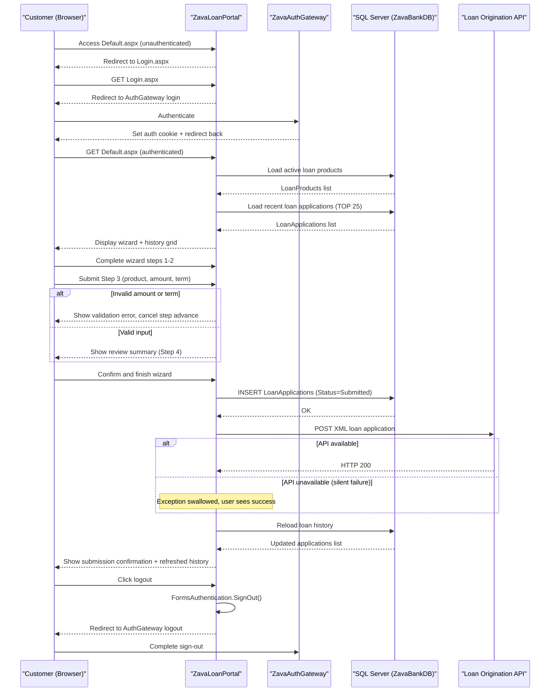

# Core Business Workflows

ZavaLoanPortal is a customer-facing loan application portal that allows authenticated users to browse available loan products, submit multi-step loan applications, and view their application history.

## Domain Entities

| Entity | Service / Bounded Context | Description | Key Relationships |
|---|---|---|---|
| LoanProduct | Loan Catalog | A type of loan offered by the bank (e.g., personal loan, mortgage); controls what products are selectable during application | One LoanProduct → many LoanApplications |
| LoanApplication | Loan Origination | A customer's request to borrow a specific amount under a chosen product for a defined term | Belongs to one LoanProduct; linked to one Customer (by ID) |
| Customer | Identity (external — ZavaAuthGateway) | An authenticated user of the portal; identity managed externally | One Customer → many LoanApplications |

## Service-to-Domain Mapping

| Service | Domain Context | Owned Entities | External Dependencies |
|---|---|---|---|
| ZavaLoanPortal | Loan Origination | LoanApplication, LoanProduct (read) | ZavaAuthGateway (authentication), Loan Origination API (downstream processing), SQL Server (ZavaBankDB) |
| ZavaAuthGateway | Identity & Authentication | Customer (identity) | None visible from portal |
| Loan Origination API | Loan Processing | Unknown (downstream) | Receives submitted application data from ZavaLoanPortal |

## Primary Workflows

### Workflow 1: User Authentication

A visitor accessing any protected page is redirected to `Login.aspx`, which immediately redirects the browser to the externally configured `AuthGatewayLoginUrl` with a `ReturnUrl` parameter. The `ZavaAuthGateway` handles credential collection and issues a Forms Authentication cookie (`.ZAVAAUTH`). On return, ASP.NET Forms Authentication validates the cookie and grants access. If already authenticated, the user is sent directly to `Default.aspx`.

Steps:
1. Unauthenticated request arrives at any page.
2. `Default.aspx` `Page_Load` detects `!Request.IsAuthenticated` and redirects to `Login.aspx?ReturnUrl=...`.
3. `Login.aspx` builds the gateway URL and redirects the browser to `AuthGatewayLoginUrl?ReturnUrl=...`.
4. `ZavaAuthGateway` authenticates the user and sets the `.ZAVAAUTH` cookie.
5. Browser is redirected back to `Default.aspx` (or original `ReturnUrl`).
6. Forms Authentication validates the cookie; the user is granted access.

### Workflow 2: Loan Application Submission (Multi-Step Wizard)

An authenticated customer completes a four-step wizard (`wizLoanApplication`) to submit a loan application. At the final step the application is persisted to the database and forwarded to the Loan Origination API.

Steps:
1. **Step 1 — Personal Details**: Customer enters first and last name.
2. **Step 2 — Contact Information**: Customer provides contact details.
3. **Step 3 — Loan Details**: Customer selects a loan product from the dropdown (populated from `LoanProducts` table), enters requested amount and term in months. Validation ensures both are valid numeric values before advancing.
4. **Step 4 — Review**: A summary of name, amount, and term is displayed for confirmation.
5. **Submit**: On wizard finish:
   - A new `LoanApplications` row is inserted into the database with status `Submitted`, the current date, and the authenticated user as `AssignedOfficer`.
   - The application is POSTed as XML to the Loan Origination API.
   - The loan history grid is refreshed to show the newly submitted application.

### Workflow 3: View Loan History

On every authenticated page load of `Default.aspx`, the 25 most recent loan applications (ordered by date descending) are fetched from the database and displayed in a `GridView`. A row command (`ReviewApplication`) allows selecting an application for review (currently shows a status message only — no detailed review screen is implemented).

### Workflow 4: User Sign-Out

When the user clicks the logout link, `Logout.aspx` calls `FormsAuthentication.SignOut()` to clear the authentication cookie, then redirects the browser to `AuthGatewayLogoutUrl` to complete the sign-out at the identity provider.

## Cross-Service Data Flows

ZavaLoanPortal has a single outbound cross-service data flow: upon loan application submission, it POSTs a hand-built XML payload to the Loan Origination API. The portal does not receive or process a meaningful response — the response body is read and discarded, and any exceptions are silently caught. There is no confirmation, tracking ID, or callback from the downstream service back to the portal.

There is no gateway aggregation or composition pattern. The portal fetches all data from its own SQL Server database; the only cross-service call is the fire-and-forget POST to the Loan Origination API.

**Fallback behavior**: If the Loan Origination API is unavailable, the application is still persisted to the database and the user sees a success message. The downstream failure is invisible to the user and leaves no error trace.

## Business Workflow Sequence

## Business Rules & Decision Logic

**Validation Rules:**
- Loan amount (`txtRequestedAmount`) must parse to a valid `decimal` — non-numeric input blocks the wizard from advancing to the review step.
- Loan term (`txtTermMonths`) must parse to a valid `int` — non-numeric input blocks the wizard from advancing.
- No minimum/maximum loan amount or term validation is implemented beyond type parsing.

**Authentication & Authorization:**
- All pages except `Login.aspx` and `Logout.aspx` require an authenticated user (`<deny users="?" />`).
- Any authenticated user can submit a loan application on behalf of any `CustomerID` value — the customer ID is taken from a text field (`txtCustomerId`, defaulting to `1`) with no server-side ownership check.
- The authenticated user's identity (`User.Identity.Name`) is recorded as `AssignedOfficer` on every submitted application.

**State Transitions:**
- Loan applications are created with status `Submitted`; no further state transitions are implemented in this portal.

**Cross-Cutting Concerns:**
- **Error handling**: The outbound call to the Loan Origination API silently swallows all exceptions. There is no retry, dead-letter queue, or error notification.
- **Transactions**: No explicit transaction management — the INSERT to the database and the POST to the API are not wrapped in a transaction. A database success followed by an API failure leaves an application in the database that was never forwarded downstream.
- **Audit trail**: The application date and assigned officer are recorded per loan application; no further audit logging exists.
- **CSRF protection**: No anti-forgery tokens are implemented. Web Forms `ViewState` provides partial protection, but there is no explicit `ValidateAntiForgeryToken` equivalent.
