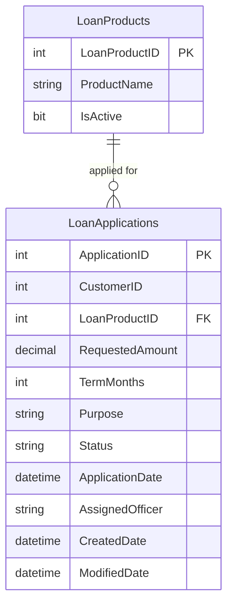

# Data Architecture & Persistence Layer

ZavaLoanPortal uses a single SQL Server database (`ZavaBankDB`) accessed exclusively through raw ADO.NET — no ORM, no migration tool, and no repository abstraction layer is present; all SQL is inlined within WebForms code-behind files.

## Database Configuration

| Service/Module | DB Type | Profile | Driver | Connection | Migration Tool |
|---------------|---------|---------|--------|------------|---------------|
| ZavaLoanPortal | SQL Server | All (single config) | System.Data.SqlClient (built-in .NET 4.8) | `Server=sqlserver,1433;Database=ZavaBankDB;User Id=sa;******;TrustServerCertificate=true` | None — no schema migration tooling configured |

No Flyway, Liquibase, EF Migrations, or equivalent tool is in use. Schema management and seeding are entirely manual.

## Data Ownership per Service

| Service | Tables Owned | ORM Framework | Caching | Notes |
|---------|-------------|--------------|---------|-------|
| ZavaLoanPortal | LoanProducts, LoanApplications | None (raw ADO.NET) | None | All SQL is inlined in `Default.aspx.cs` code-behind; no repository or service layer |

## Entity Model

> Note: No ORM entity classes exist in the codebase. The entity model below is inferred from SQL statements in `Default.aspx.cs`. Field names and types are derived from query column references and INSERT parameter names.

## Key Repository Methods

No repository interfaces or data-access objects exist. All database access is performed via inline ADO.NET in `Default.aspx.cs`:

| Service | Method (inline) | SQL / Operation | Purpose |
|---------|----------------|-----------------|---------|
| ZavaLoanPortal | `BindLoanProducts()` | `SELECT LoanProductID, ProductName FROM LoanProducts WHERE IsActive=1 ORDER BY ProductName` | Populates loan product drop-down on page load |
| ZavaLoanPortal | `BindLoanHistory()` | `SELECT TOP 25 ApplicationID, CustomerID, RequestedAmount, TermMonths, Status, ApplicationDate FROM LoanApplications ORDER BY ApplicationDate DESC` | Populates loan history GridView on page load |
| ZavaLoanPortal | `wizLoanApplication_FinishButtonClick` | `INSERT INTO LoanApplications (CustomerID, LoanProductID, RequestedAmount, TermMonths, Purpose, Status, ApplicationDate, AssignedOfficer, CreatedDate, ModifiedDate) VALUES (...)` | Persists a new loan application on wizard completion |

No stored procedures, views, or named queries are used. There is no transaction management; each database call opens and closes its own connection.

## Caching Strategy

No caching layer is configured or used. Every page load and postback results in direct SQL queries to the database. Loan product data (read-only, rarely changing) is fetched on every request with no in-memory or distributed cache.

## Data Ownership Boundaries

ZavaLoanPortal is a single-service application with a single shared SQL Server database. There are no bounded-context boundaries, microservice splits, or schema-per-service separations. Both `LoanProducts` and `LoanApplications` are accessed exclusively by the portal itself.

Cross-service data access does not apply in this context. The Loan Origination API (downstream) receives loan data via XML HTTP POST but does not share the same database; its data model is opaque to this application.

### Data Classification & Sensitivity

| Entity | Sensitive Fields | Classification | Controls in Place |
|--------|-----------------|---------------|-------------------|
| LoanApplications | CustomerID (links to customer PII), RequestedAmount, Purpose, AssignedOfficer | PII (financial) | None — no encryption-at-rest, masking, or field-level access control configured |
| LoanProducts | ProductName, IsActive | None | N/A |

**`LoanApplications`** stores financial PII: customer identifiers, requested loan amounts, loan purpose, and the name of the assigned officer. No encryption-at-rest (e.g., SQL Server TDE, column-level encryption) is configured. The database connection string in `web.config` is stored in plain text, including the SQL Server `sa` account password, presenting a critical credential exposure risk.
