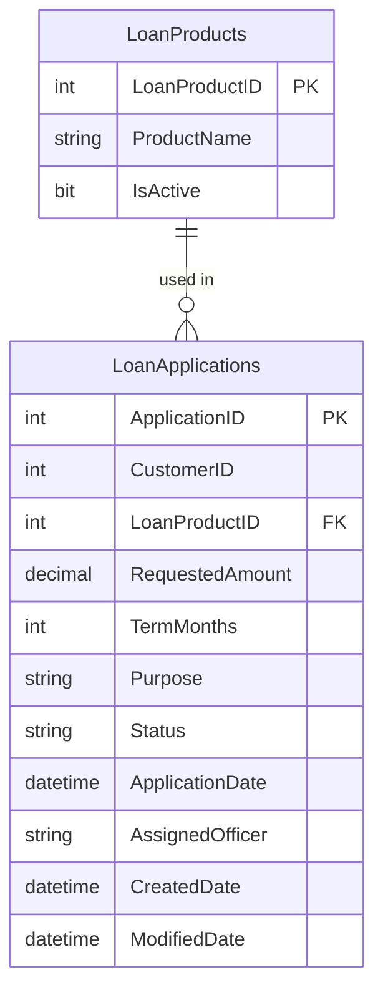

# Data Architecture & Persistence Layer

ZavaLoanPortal uses a single SQL Server database (`ZavaBankDB`) accessed through raw ADO.NET — there is no ORM, no migration tool, and no caching layer; all schema management is performed outside the application.

## Database Configuration

| Service/Module | DB Type | Profile | Driver | Connection | Migration Tool |
|---|---|---|---|---|---|
| ZavaLoanPortal | SQL Server | All (single profile) | System.Data.SqlClient (built-in .NET 4.8) | Server=sqlserver,1433; Database=ZavaBankDB | None — schema managed externally |

The application reads the connection string `ZavaBankDb` from `web.config` at runtime. There is no Flyway, Liquibase, EF Migrations, or equivalent migration mechanism; the database schema is assumed to be pre-created. No seed data scripts are included in the repository.

> Note: The `web.config` connection string contains a hardcoded password (`Zava123!`) and uses `TrustServerCertificate=true`, bypassing TLS certificate validation.

## Data Ownership per Service

| Service | Tables Owned | ORM Framework | Caching | Notes |
|---|---|---|---|---|
| ZavaLoanPortal | LoanApplications, LoanProducts | None (raw ADO.NET) | None | All queries are inline SQL in code-behind files |

## Entity Model

> Note: No ORM entity classes exist. The data model below is inferred from SQL queries found in `Default.aspx.cs`.

## Key Repository Methods

There are no repository classes or interfaces. All data access is performed with inline ADO.NET code directly inside Web Forms code-behind methods.

| Service | Method (code-behind) | SQL Executed | Purpose |
|---|---|---|---|
| Default.aspx.cs | BindLoanProducts() | SELECT LoanProductID, ProductName FROM LoanProducts WHERE IsActive=1 ORDER BY ProductName | Populates the loan product dropdown |
| Default.aspx.cs | BindLoanHistory() | SELECT TOP 25 ApplicationID, CustomerID, RequestedAmount, TermMonths, Status, ApplicationDate FROM LoanApplications ORDER BY ApplicationDate DESC | Populates the recent applications grid |
| Default.aspx.cs | wizLoanApplication_FinishButtonClick() | INSERT INTO LoanApplications (...) VALUES (...) | Persists a new loan application on wizard completion |

No transactions, stored procedures, or views are referenced. No batch queries or custom finders are implemented.

## Caching Strategy

No caching layer is configured. There is no use of `System.Web.Caching.Cache`, `MemoryCache`, `IDistributedCache`, Redis, or any other caching mechanism. Every page load executes fresh SQL queries against the database.

## Data Ownership Boundaries

ZavaLoanPortal owns the entire `ZavaBankDB` database. There is a single data store shared by one application — no database-per-service partitioning, no schema separation, and no logical bounded-context isolation within the database. No cross-service database access patterns exist within the portal code.

The Loan Origination API (external) receives loan data via XML POST but does not share the `ZavaBankDB` database; it maintains its own data store (unknown topology).

### Data Classification & Sensitivity

| Entity | Sensitive Fields | Classification | Controls in Place |
|---|---|---|---|
| LoanApplications | CustomerID, RequestedAmount, TermMonths, Purpose, AssignedOfficer | PII / Financial | None — no encryption-at-rest, no field-level masking, no access controls in application code |
| LoanProducts | ProductName, IsActive | Non-sensitive | N/A |

The `LoanApplications` table stores customer financial data (loan amounts, terms, purpose) linked to customer identifiers. No encryption-at-rest is configured, no data masking is applied, and no field-level access controls exist at the application layer. The database credentials are hardcoded in plaintext in `web.config` with a broad `sa` (system administrator) account, granting unrestricted access to the entire SQL Server instance.
