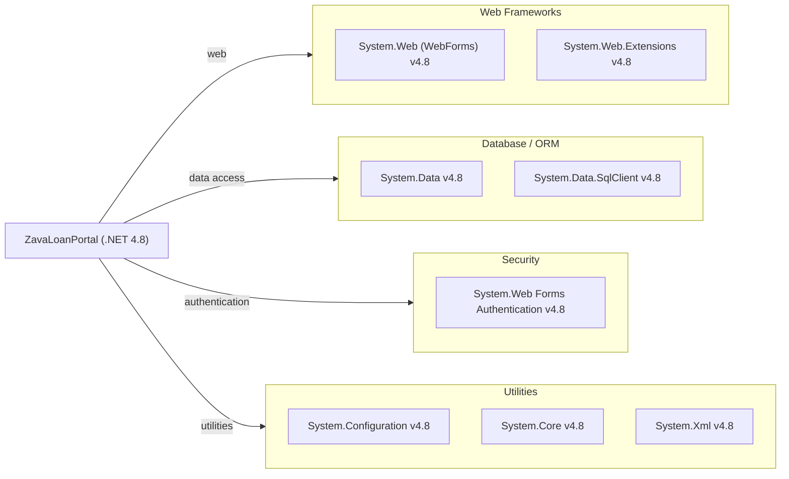

# Dependency Map

ZavaLoanPortal is a .NET Framework 4.8 ASP.NET WebForms application with no third-party NuGet packages; all dependencies are built-in .NET Framework assemblies referenced directly in the project file.

## Dependencies

### Dependency Summary

| Category | Count | Key Libraries | Notes |
|----------|-------|---------------|-------|
| Web Frameworks | 2 | System.Web (WebForms), System.Web.Extensions | Legacy WebForms stack on .NET Framework 4.8 |
| Database / ORM | 2 | System.Data, System.Data.SqlClient | Raw ADO.NET; no ORM in use |
| Security | 1 | System.Web Forms Authentication | Built-in Forms Authentication module |
| Utilities | 3 | System.Configuration, System.Core, System.Xml | Standard BCL assemblies |

### Version & Compatibility Risks

All dependencies are built-in .NET Framework 4.8 BCL/FCL assemblies — there are no third-party NuGet packages. While .NET Framework 4.8 is still supported by Microsoft (Long-Term Support), it is a Windows-only runtime with no cross-platform path. `System.Data.SqlClient` is in maintenance mode; `Microsoft.Data.SqlClient` is the current, actively developed successor. ASP.NET WebForms itself is not available in .NET Core / .NET 5+, making a full framework migration a significant re-architecture effort rather than a simple upgrade.

### Notable Observations

- **No third-party NuGet packages**: The `packages.config` is empty. Every dependency is a built-in .NET Framework assembly, which simplifies dependency management but also means no modern library improvements (e.g., Dapper, Polly) are in use.
- **Legacy data access**: Direct use of `System.Data.SqlClient` with inline SQL strings presents both a modernization and security concern; migrating to `Microsoft.Data.SqlClient` with parameterized queries (already partially done) and/or an ORM is recommended.
- **Windows-only runtime lock-in**: ASP.NET WebForms and `System.Web` are not available in .NET 6+. Migrating to ASP.NET Core would require rewriting the UI layer (Razor Pages or Blazor are the closest equivalents).
- **No logging or observability libraries**: The application contains no structured logging framework (e.g., Serilog, NLog) or telemetry/tracing libraries, limiting operational visibility in production.

## Test Dependencies

No test-scope dependencies detected.

Total test-scope dependencies: 0

No test project or test framework (xUnit, NUnit, MSTest) was found in the repository. Adding a test project with a modern framework such as xUnit or NUnit is strongly recommended before attempting any migration.
