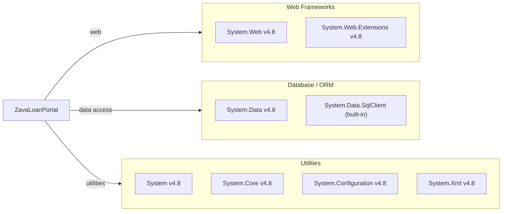

# Dependency Map

ZavaLoanPortal is a .NET Framework 4.8 ASP.NET Web Forms application with no external NuGet packages — all 7 declared dependencies are first-party .NET Framework assemblies.

## Dependencies

### Dependency Summary

| Category | Count | Key Libraries | Notes |
|---|---|---|---|
| Web Frameworks | 2 | System.Web 4.8, System.Web.Extensions 4.8 | Legacy ASP.NET Web Forms on .NET Framework 4.8 |
| Database / ORM | 2 | System.Data 4.8, System.Data.SqlClient (built-in) | Raw ADO.NET — no ORM |
| Utilities | 4 | System, System.Core, System.Configuration, System.Xml | Core .NET Framework assemblies |

### Version & Compatibility Risks

All dependencies are built-in .NET Framework 4.8 assemblies with no external NuGet packages declared in `packages.config`. While .NET Framework 4.8 is the last major release and remains supported by Microsoft, it is in maintenance mode and does not receive new features. The use of raw ADO.NET (`System.Data.SqlClient`) means the application is tied to the Windows-only SQL Server client stack; migration to `Microsoft.Data.SqlClient` (cross-platform) would be required for a .NET 6+ modernization. ASP.NET Web Forms is not available in .NET Core/.NET 5+, making the entire presentation layer a migration blocker for cloud-native targets.

### Notable Observations

- **No external NuGet packages**: The project relies exclusively on built-in .NET Framework assemblies, keeping the dependency footprint minimal but also highly coupled to .NET Framework.
- **Web Forms is a dead-end for modernization**: `System.Web` and Web Forms are not ported to .NET 5/6/7/8/9/10; migrating to modern .NET requires rewriting the UI layer in ASP.NET Core MVC, Razor Pages, or Blazor.
- **No logging framework**: The application has no structured logging library (Serilog, NLog, Microsoft.Extensions.Logging), relying on silent exception swallowing in the `SubmitApi` method.
- **No security/auth library**: Authentication is fully delegated to an external gateway via redirects; there are no token validation or authorization libraries in the project.

## Test Dependencies

No test-scope dependencies detected.

Total test-scope dependencies: 0

No test project or test framework (xUnit, NUnit, MSTest) was found in the repository. There are no unit or integration tests.
